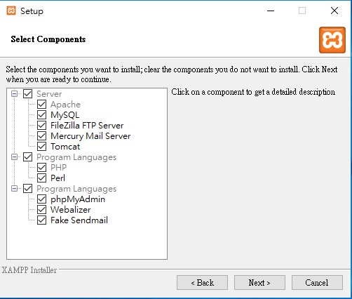
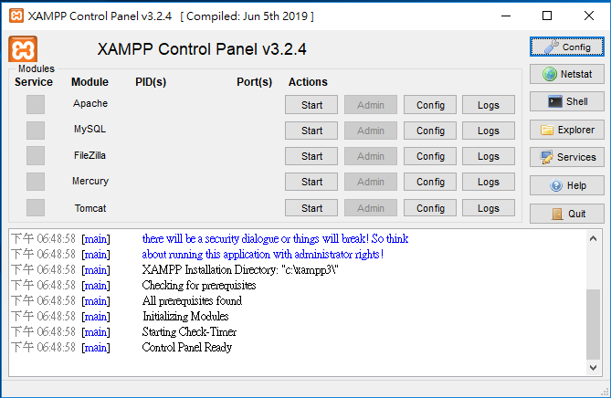
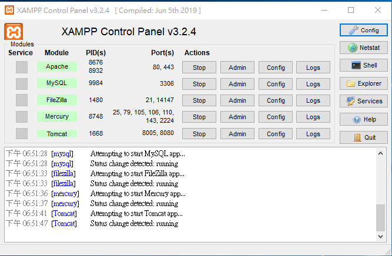

# 安裝網站伺服器XAMPP

# XAMPP管理介面

# 網站伺服器XAMPP 檔案結構

ftp連線

開 站台管理員
 設置:IP 使用著 密碼

Cmd

查:
ipconfig

https://filezilla-project.org/

html架設
https://github.com/MyDearGreatTeacher/CS4high/tree/master/web

https://www.w3schools.com/default.asp

hph

https://www.w3schools.com/php/default.asp

